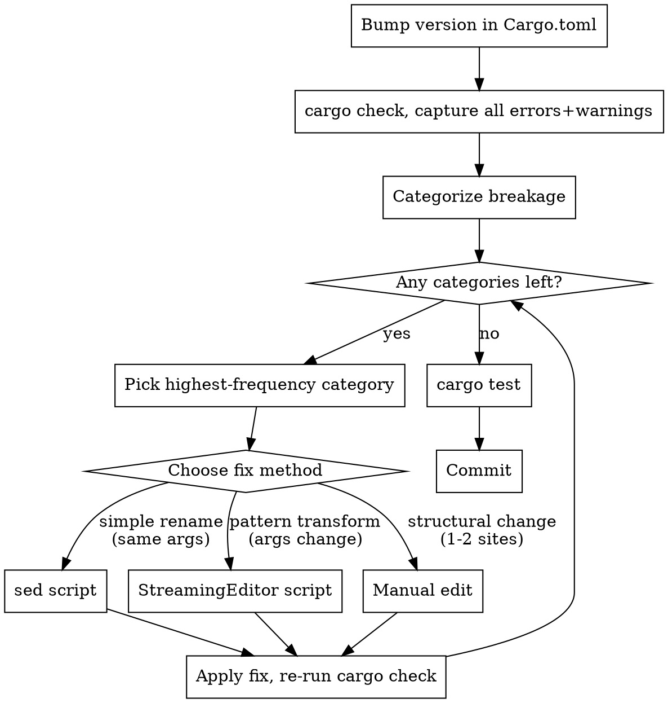

# Rust Dependency Upgrade

Systematically upgrade a Rust crate from one version to another by categorizing all breakage, then fixing each category with the most efficient method — sed for mechanical renames, a Python StreamingEditor for pattern transforms, and manual edits only for structural changes.

## When to Use

- Bumping a crate version in `Cargo.toml` causes compile errors
- `cargo tree` shows two versions of the same crate (version conflict)
- Deprecation warnings appear after a version bump
- Type mismatches like `expected egui::Context, found eframe::egui::Context`

## When NOT to Use

- Adding a new dependency (no breakage to fix)
- Patch version bumps that don't change APIs (0.31.0 → 0.31.1)
- The crate has a migration guide that's a simple checklist with < 5 items

## Process



## Phase 1: Identify All Breakage

Bump the version in `Cargo.toml`, then capture every error and warning:

```bash
cargo check 2>&1 | tee /tmp/upgrade-errors.txt
```

Also check for version conflicts:

```bash
cargo tree -d  # show duplicated crates
```

If `cargo tree` shows two versions of the same crate (e.g., `egui v0.31.1` and `egui v0.34.0`), ALL dependent crates must be bumped together. Fix this first.

## Phase 2: Categorize Breakage

Parse the error output and group by pattern. Example categorization:

| Category | Count | Example | Fix Method |
|----------|-------|---------|------------|
| Type rename: `Rounding` → `CornerRadius` | 12 | `Rounding::same(4.0)` | sed |
| Method rename: `exact_width` → `exact_size` | 8 | `.exact_width(40.0)` | sed |
| Float→int literal: `4.0` → `4` in CornerRadius | 12 | `CornerRadius::same(4.0)` | sed (scoped) |
| Method rename + signature change: `show` → `show_inside` | 15 | `.show(ctx, \|ui\|` on Panels only | StreamingEditor |
| Trait method renamed: `update` → `ui` with new params | 1 | `fn update(&mut self, ctx, _frame)` | Manual |

**Sort by frequency.** Fix highest-count categories first — they clear the most errors per fix.

## Phase 3: Fix by Category

### Method 1: sed — Simple Renames (same arguments)

Use when: the old name is replaced by a new name, arguments unchanged, no ambiguity.

```bash
# Scope narrowly: specific files, specific pattern
sed -i '' 's/\.exact_width(/.exact_size(/g' crates/app/src/*.rs
sed -i '' 's/\.exact_height(/.exact_size(/g' crates/app/src/*.rs
sed -i '' 's/SidePanel::left/Panel::left/g' crates/app/src/*.rs
sed -i '' 's/close_menu()/close_kind(egui::UiKind::Menu)/g' crates/app/src/*.rs
```

**Rules for sed safety:**
- Scope to the narrowest file glob possible (`crates/app/src/*.rs`, not `**/*.rs`)
- Use word boundaries or surrounding context to avoid false matches
- Run `cargo check` after each sed command, not after all of them
- If a pattern appears in both fixable and non-fixable contexts (e.g., `.show()` on Panel vs Window), do NOT use sed — use StreamingEditor or manual

### Method 2: StreamingEditor — Pattern Transforms

Use when: the rename requires context awareness (e.g., only apply to certain call sites, or arguments change shape).

```python
#!/usr/bin/env -S uv run
"""Fix egui 0.34 Panel::show → show_inside migration.

Only changes .show(ctx, on Panel builders, NOT on Window builders.
"""

import re
import sys
from pathlib import Path


class StreamingEditor:
    """Load a file, apply transforms, write back only if changed."""

    def __init__(self, path: Path) -> None:
        self.path = path
        self.lines = path.read_text().splitlines()
        self.dirty = 0

    def replace_line(self, index: int, old: str, new: str) -> None:
        """Replace exact substring in a specific line."""
        if old in self.lines[index]:
            self.lines[index] = self.lines[index].replace(old, new)
            self.dirty += 1

    def replace_all(self, old: str, new: str) -> None:
        """Replace in every line."""
        for i, line in enumerate(self.lines):
            if old in line:
                self.lines[i] = line.replace(old, new)
                self.dirty += 1

    def replace_pattern(self, pattern: str, replacement: str) -> None:
        """Regex replace in every line."""
        regex = re.compile(pattern)
        for i, line in enumerate(self.lines):
            new_line = regex.sub(replacement, line)
            if new_line != line:
                self.lines[i] = new_line
                self.dirty += 1

    def save(self) -> bool:
        """Write file if any changes were made. Returns True if written."""
        if self.dirty > 0:
            self.path.write_text("\n".join(self.lines) + "\n")
            return True
        return False


def fix_panel_show(path: Path) -> None:
    """Change .show(ctx, to .show_inside(ui, on Panel builders only."""
    ed = StreamingEditor(path)

    # Track whether we're in a Panel builder chain
    for i, line in enumerate(ed.lines):
        # Panel builders: Panel::left, Panel::right, Panel::top, Panel::bottom
        # Window builders: Window::new — do NOT change these
        if "Panel::" in line:
            # Look ahead for .show(ctx, in the chain
            for j in range(i, min(i + 5, len(ed.lines))):
                if ".show(ctx," in ed.lines[j] or ".show(ctx, " in ed.lines[j]:
                    ed.replace_line(j, ".show(ctx,", ".show_inside(ui,")
                    break

    if ed.save():
        print(f"  fixed: {path}")


def main() -> None:
    root = Path(sys.argv[1]) if len(sys.argv) > 1 else Path("crates/app/src")
    for rs_file in sorted(root.glob("*.rs")):
        fix_panel_show(rs_file)


if __name__ == "__main__":
    main()
```

**When to use StreamingEditor over sed:**
- The same text (`.show(`) appears in both fixable and non-fixable contexts
- The fix depends on surrounding lines (lookahead/lookbehind across lines)
- Arguments need reordering or insertion, not just renaming
- The replacement depends on the matched content (captures)

### Method 3: Manual Edit — Structural Changes

Use when: only 1-2 sites exist, or the change is too structural for automation (trait method signature change, new required parameters, builder pattern restructuring).

Don't automate one-off fixes. If there are only 1-2 occurrences, read the code, understand the new API, and edit by hand.

## Phase 4: Verify

After all categories are fixed:

```bash
# Zero errors
cargo check 2>&1 | grep "^error" | wc -l

# Zero deprecation warnings
cargo check 2>&1 | grep "deprecated" | wc -l

# All tests pass
cargo test
```

## Common Mistakes

| Mistake | Fix |
|---------|-----|
| Using sed on ambiguous patterns (`.show(` matches both Panel and Window) | Use StreamingEditor with context awareness |
| Bumping one crate but not its companion (`egui` without `eframe`) | Check `cargo tree -d` for duplicate versions first |
| Fixing errors one at a time instead of categorizing | Capture ALL errors first, group, then batch-fix |
| Running sed on the entire repo (`**/*.rs`) | Scope to the narrowest directory possible |
| Not checking the crate's migration guide / changelog | Read it first — many renames are documented |

## Quick Reference: Fix Method Decision

```
Is the change a simple rename with identical arguments?
  YES → sed (scoped to affected files)
  NO →
    Does the same text appear in fixable AND non-fixable contexts?
      YES → StreamingEditor (context-aware)
      NO →
        Are there more than 3 occurrences?
          YES → StreamingEditor (pattern transform)
          NO → Manual edit
```
