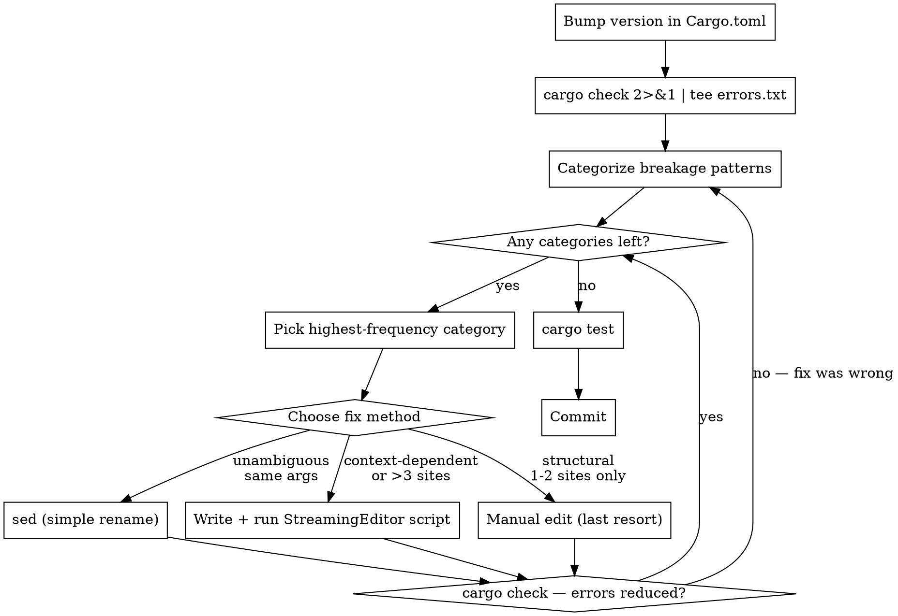

# Rust Dependency Upgrade

Upgrade a Rust crate from one version to another by categorizing all breakage, then fixing each category with CLI tools — `sed` for mechanical renames, a purpose-built Python `StreamingEditor` script for context-aware transforms, and manual edits only as a last resort for truly structural 1-2 site changes.

**The default is scripted automation.** Writing a 30-line Python script that runs in 0.1 seconds over 50 files is always faster than an agent opening, reading, editing, and saving 50 files one at a time. Manual edits are the exception, not the rule.

## When to Use

- Bumping a crate version in `Cargo.toml` causes compile errors
- `cargo tree` shows two versions of the same crate (version conflict)
- Deprecation warnings appear after a version bump
- Type mismatches like `expected egui::Context, found eframe::egui::Context`

## When NOT to Use

- Adding a new dependency (no breakage to fix)
- Patch version bumps that don't change APIs (0.31.0 → 0.31.1)
- The crate has a migration guide that's a simple checklist with < 5 items

## Process



## Phase 1: Identify All Breakage

Bump the version, then capture every error and warning in one pass:

```bash
cargo check 2>&1 | tee /tmp/upgrade-errors.txt
cargo tree -d  # show duplicated crates — fix version conflicts first
```

If `cargo tree -d` shows two versions of the same crate (e.g., `egui v0.31` and `egui v0.34`), bump ALL companion crates together before proceeding.

## Phase 2: Categorize Breakage

Parse the error output with CLI tools to group by pattern:

```bash
# Extract unique error patterns
grep "^error" /tmp/upgrade-errors.txt | sed 's/\[E[0-9]*\]//g' | sort | uniq -c | sort -rn

# Extract deprecated warnings
grep "deprecated" /tmp/upgrade-errors.txt | grep -oP 'deprecated.*' | sort | uniq -c | sort -rn

# Find all affected files for a specific pattern
grep -rn "exact_width" crates/app/src/*.rs | wc -l
```

Build a table sorted by frequency:

| Category | Count | Fix Method |
|----------|-------|------------|
| Method rename: `exact_width` → `exact_size` | 8 | `sed` |
| Type rename: `Rounding` → `CornerRadius` | 12 | `sed` |
| Float→int in CornerRadius: `4.0` → `4` | 12 | `sed` (scoped to lines containing `CornerRadius`) |
| `.show(ctx,` → `.show_inside(ui,` on Panels only (not Windows) | 15 | StreamingEditor script |
| Trait method `update` → `ui` with signature change | 1 | Manual |

**Fix highest-count categories first.** Each scripted fix clears many errors at once.

## Phase 3: Fix by Category

### Method 1: `sed` — Simple Renames

**Use when:** old name → new name, arguments unchanged, pattern is unambiguous in context.

```bash
# Always scope narrowly
sed -i '' 's/\.exact_width(/.exact_size(/g' crates/app/src/*.rs
sed -i '' 's/\.exact_height(/.exact_size(/g' crates/app/src/*.rs
sed -i '' 's/SidePanel::left/Panel::left/g' crates/app/src/*.rs
sed -i '' 's/TopBottomPanel::top/Panel::top/g' crates/app/src/*.rs
sed -i '' 's/close_menu()/close_kind(egui::UiKind::Menu)/g' crates/app/src/*.rs
sed -i '' 's/wants_keyboard_input/egui_wants_keyboard_input/g' crates/app/src/*.rs
sed -i '' 's/screen_rect()/content_rect()/g' crates/app/src/*.rs

# Scoped sed: only change float literals on lines containing CornerRadius
sed -i '' '/CornerRadius/s/\([0-9]\)\.0/\1/g' crates/app/src/*.rs

# Verify after EACH sed
cargo check 2>&1 | grep "^error" | wc -l
```

**sed rules:**
- Scope to the narrowest file glob (`crates/app/src/*.rs`, not `**/*.rs`)
- Verify with `cargo check` after each command
- If a pattern matches both fixable and non-fixable contexts, use StreamingEditor instead

### Method 2: StreamingEditor Script — Context-Aware Transforms

**Use when:** the same text appears in both fixable and non-fixable contexts, arguments change shape, or the fix depends on surrounding lines. **Write a new script for each upgrade** — it runs in milliseconds and is faster than manual edits.

The `StreamingEditor` class uses the Python `with` statement. On enter, it loads the file and strips trailing newlines. On exit, it writes back only if changes were made. All line traversal is in **reverse order** — this preserves compiler-reported line numbers when transforms insert or delete lines.

```python
#!/usr/bin/env -S uv run
"""Fix egui 0.34 Panel::show → show_inside migration.

Only changes .show(ctx, on Panel builder chains, NOT on Window::new chains.
"""

import re
import sys
from pathlib import Path


class StreamingEditor:
    """Context manager: loads file on enter, saves on exit if dirty."""

    def __init__(self, path: Path) -> None:
        self.path = path
        self.lines: list[str] = []
        self.dirty = 0

    def __enter__(self) -> "StreamingEditor":
        self.lines = self.path.read_text().splitlines()
        self.dirty = 0
        return self

    def __exit__(self, exc_type, exc_val, exc_tb) -> None:
        if self.dirty and exc_type is None:
            with open(self.path, encoding="utf-8", mode="w") as handle:
                handle.write("\n".join(self.lines))
                handle.write("\n")
            print(f"  fixed ({self.dirty} changes): {self.path}")
            self.dirty = 0

    def replace_all(self, old: str, new: str) -> None:
        """Replace substring in every line. Always reverse order."""
        for i, line in reversed(list(enumerate(self.lines))):
            if old in line:
                self.lines[i] = line.replace(old, new)
                self.dirty += 1

    def replace_pattern(self, pattern: str, replacement: str) -> None:
        """Regex replace in every line. Always reverse order."""
        regex = re.compile(pattern)
        for i, line in reversed(list(enumerate(self.lines))):
            result = regex.sub(replacement, line)
            if result != line:
                self.lines[i] = result
                self.dirty += 1


def fix_panel_show(path: Path) -> None:
    """Change .show(ctx, to .show_inside(ui, on Panel builders only."""
    with StreamingEditor(path) as sed:
        # Reverse traversal: find Panel:: lines, look ahead for .show(ctx,
        for i, line in reversed(list(enumerate(sed.lines))):
            if "Panel::" in line:
                for j in range(i, min(i + 5, len(sed.lines))):
                    if ".show(ctx," in sed.lines[j]:
                        sed.lines[j] = sed.lines[j].replace(
                            ".show(ctx,", ".show_inside(ui,"
                        )
                        sed.dirty += 1
                        break


def main() -> None:
    root = Path(sys.argv[1]) if len(sys.argv) > 1 else Path("crates/app/src")
    for rs in sorted(root.glob("*.rs")):
        fix_panel_show(rs)


if __name__ == "__main__":
    main()
```

**Key principles:**
- Writing this script takes 2 minutes and fixes 15 files in 0.1 seconds. An agent manually editing those files would take 15+ minutes. **Always prefer writing a script.**
- **Always traverse in reverse order** (`reversed(list(enumerate(lines)))`). This preserves compiler-reported line numbers so subsequent fixes remain valid. There is no reason to go forward.

**When to write a StreamingEditor script:**
- Same text appears in fixable AND non-fixable contexts (`.show(` on Panel vs Window)
- Fix depends on surrounding lines (lookahead across a builder chain)
- Arguments need reordering or insertion
- More than 3 occurrences of a non-trivial transform

### Method 3: Manual Edit — Last Resort

**Use when:** only 1-2 sites exist AND the change is truly structural (trait method signature, new required type parameter, completely different API shape).

**Do not use manual edits when there are 3+ occurrences.** Write a script instead.

## Phase 4: Verify

```bash
# Zero errors
cargo check 2>&1 | grep "^error" | wc -l   # must be 0

# Zero deprecation warnings
cargo check 2>&1 | grep "deprecated" | wc -l   # must be 0

# All tests pass
cargo test

# No version conflicts
cargo tree -d   # must show nothing
```

## Common Mistakes

| Mistake | Fix |
|---------|-----|
| Editing files one at a time via agent tools | Write a sed or StreamingEditor script |
| Using sed on ambiguous patterns | Use StreamingEditor with context awareness |
| Bumping one crate but not its companion | Check `cargo tree -d` first |
| Fixing errors one at a time instead of categorizing | Capture ALL errors, group, batch-fix |
| Running sed on `**/*.rs` | Scope to narrowest directory |
| Not reading the crate's changelog | Read it first — renames are documented |
| Dispatching an agent to "fix all the errors" | Agent will edit files manually; write a script instead |

## Fix Method Decision

```
Is the change a simple rename with identical arguments?
  YES → Is the pattern unambiguous in context?
    YES → sed
    NO  → StreamingEditor script
  NO →
    Are there 3+ occurrences?
      YES → StreamingEditor script
      NO  → Manual edit (only for 1-2 truly structural changes)
```
